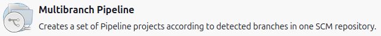
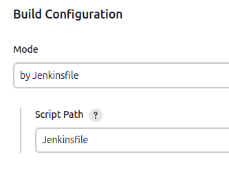
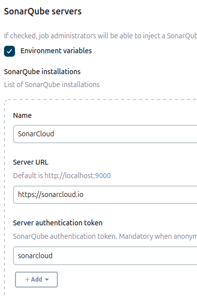
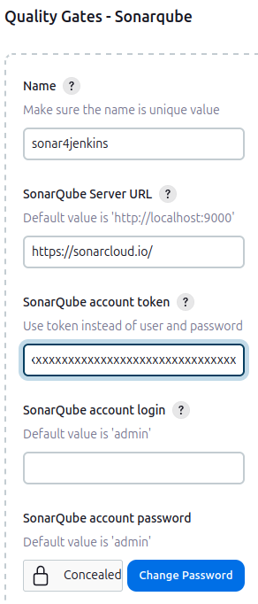
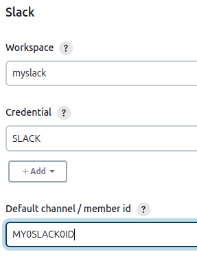
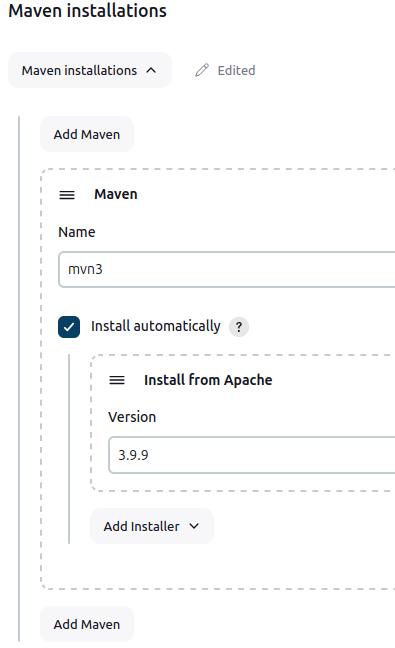
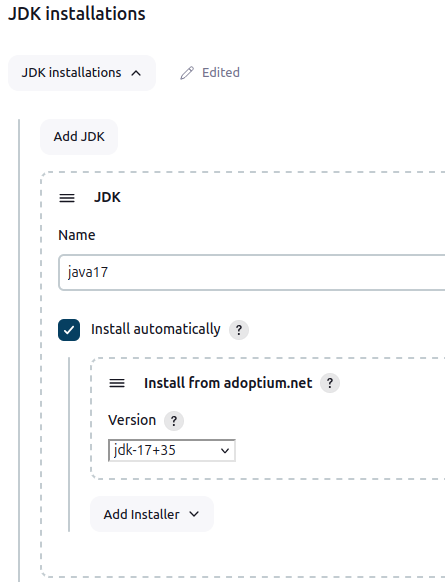
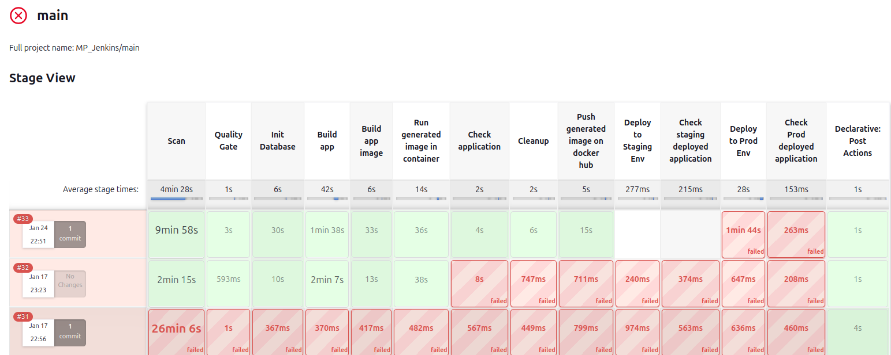

# If you want to use your own Jenkins Instance...

You need to install the following Jenkins plugins :

- docker-build-step
- Docker Commons Plugin
- Sonar Quality Gates Plugin
- SonarQube Scanner for Jenkins
- SSH Agent Plugin
- Eclipse Temurin installer Plugin
- Slack Notification Plugin

NB : eazytraining/jenkins docker image is used

**################################################################################**

In order to use the pipeline, you'll have to configure Jenkins.
First create a "multibranch pipeline" job

Fill the "Branch Sources" section with the information related to your repository. In the "Build Configuration" section, leave the "Script Path" value as it is, unless you place the Jenkinsfile in another location.

Then go to "Manage Jenkins > System", and set the "SonarQube servers" section as follow :

Following is the "Quality Gates - Sonarqube" section :

And in the "Slack" section fill the fields with the required informations related to your account.

After this, go to "Manage Jenkins > Tools" and set "Maven installations as follow" :

Then set "JDK installations" the same way :

Also, don't forget to update the variables in the Jenkinsfile, with your own values :
IMAGE_NAME              => The name of the image to build and submit to the CI/CD
IMAGE_TAG               => The version of the image to be built and used
SONAR_TOKEN             => Your SonarCloud token
DOCKERHUB_CREDENTIALS   => Your DockerHub credentials
ENV_PRD                 => Your production server IP/DNS Name
ENV_STG                 => Your staging server IP/DNS Name
ENV_TST                 => Your test server IP/DNS Name
DB_HOST_STG             => Your staging DB server IP/DNS Name
DB_HOST_PRD             => Your production DB server IP/DNS Name
SONARCLD_ORG            => Your SonarCloud organization name
SONARCLD_PJ_KEY         => Your SonarCloud project key

When all of this is done, you'll be able to use the pipeline, with a simple push to your repository.

